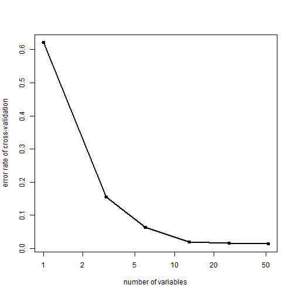

##Introduction

The goal of this project is to predict the manner (the **classe** variable in the training set)in which people participated in the Weight Lifting Excercises. The data for this project come from this source:     

http://groupware.les.inf.puc-rio.br/har.    

The training data for this project are available here: 

https://d396qusza40orc.cloudfront.net/predmachlearn/pml-training.csv

The test data are available here: 

https://d396qusza40orc.cloudfront.net/predmachlearn/pml-testing.csv

##Load the WLE Dataset
Before loading, please make sure that the training and the test data, both in csv. files, have been downloaded in your working directory.

```r
training<-read.csv("pml-training.csv")
testing<-read.csv("pml-testing.csv")
```

##Data Cleaning
The goal of this segment is to choose the reasonable variable as predictor. ie: to discard the variables not needed in fitting predictive models.

1 The WLE Dataset contains some variables that are filled with **NA or ""**.    
2 The following variables have nothing to do with the **classe** variable.     

* X   
* user_name   
* raw_timestamp_part_1   
* raw_timestamp_part_2   
* cvtd_timestamp   
* new_window   
* num_window   


```r
## remove NA and ""
discard<-rep(0,160)
for (i in 1:160){
    discard[i]<-table(is.na(training[,i])|training[,i]=="")[2]
}
training2<-training[,is.na(discard)]
## remove irrelevant variables
training3<-training2[,8:60]
## do the some process to testing data
testing2<-testing[,is.na(discard)]
testing3<-testing2[,8:60]
```

##Model Fitting 
Randomforest is used for model fitting. Because the train function in caret package runs pretty slow when fitting the WLE dataset, I used R function randomForest to do the fitting instead. I also reduced the records (number of rows) by half to accelerate the model fitting, with the sacrifice of accurucy


```r
library(caret)
```

```
## Warning: package 'caret' was built under R version 3.1.2
```

```
## Loading required package: lattice
## Loading required package: ggplot2
## Use suppressPackageStartupMessages to eliminate package startup messages.
```

```r
library(randomForest)
```

```
## Warning: package 'randomForest' was built under R version 3.1.2
```

```
## randomForest 4.6-10
## Type rfNews() to see new features/changes/bug fixes.
```

```r
set.seed(233)
trainIndex<-createDataPartition(training3$classe,p=0.5,list=F,times=1)
train<-training3[trainIndex,]
val<-training3[-trainIndex,]
set.seed(2333)
modFit1<-randomForest(classe~.,data=train,ntree=500)
```

##Out of Sample error 
To see the error rate of the model and to test its accuracy using the validation dataset:


```r
# details of the model fitting
modFit1
```

```
## 
## Call:
##  randomForest(formula = classe ~ ., data = train, ntree = 500) 
##                Type of random forest: classification
##                      Number of trees: 500
## No. of variables tried at each split: 7
## 
##         OOB estimate of  error rate: 0.74%
## Confusion matrix:
##      A    B    C    D    E class.error
## A 2782    5    2    0    1    0.002867
## B   12 1880    7    0    0    0.010005
## C    0   17 1691    3    0    0.011689
## D    0    0   19 1589    0    0.011816
## E    0    0    2    5 1797    0.003880
```

```r
# the accuracy of the model prediction using the valiadion data
confusionMatrix(predict(modFit1,val),val$classe)$table
```

```
##           Reference
## Prediction    A    B    C    D    E
##          A 2786   12    0    0    0
##          B    4 1877   20    0    0
##          C    0    8 1691   17    3
##          D    0    1    0 1586    8
##          E    0    0    0    5 1792
```

```r
confusionMatrix(predict(modFit1,val),val$classe)$overall[1]
```

```
## Accuracy 
##    0.992
```
To use cross-validation to calculate the error rate


```r
trainX<-train[,1:52]
trainY<-train[,53]
set.seed(123)
result<-rfcv(trainX,trainY,cv.fold=3)
result$error.cv
```

```
##      52      26      13       6       3       1 
## 0.01355 0.01508 0.01865 0.06400 0.15583 0.62138
```

```r
with(result, plot(n.var, error.cv, log="x", type="o", lwd=2,xlab="number of variables", ylab="error rate of cross-validation"))
```

 
